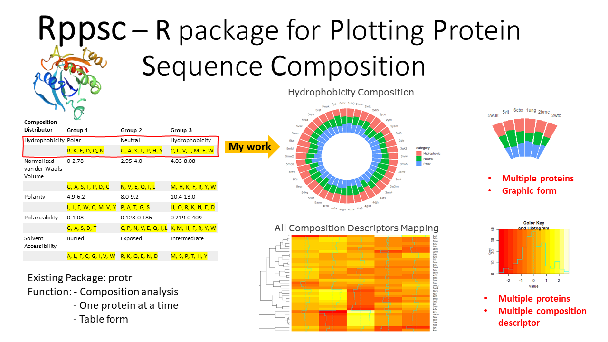

# Rppsc

<!-- badges: start -->
<!-- badges: end -->

The goal of Rppsc is to visualize the protein sequence composition regarding 
different composition descriptor.

## Installation

You can install the released version of Rppsc package using:

``` r
require("devtools")
install_github("dxjasmine/Rppsc")
library("Rppsc")
```
## Overview
An overview of the package is demonstrated as below.

Reference:
Xiao et al. (2015) Comprehensive toolkit for generating various numerical features of protein sequences  <doi:10.1093/bioinformatics/btv042>

## Contribution

Functions in this package includes:

- plotCG()
- plotAPCG()

The function plotCG and plotAPCG were authored by Jiayan Wang. Both functions take advantage of the functions in the protr package and make visualization extention.

plotCG() function uses sequence composition analysis function in protr package. ggplot2 package is used to generate visualization of proteins composition. For each plot, one compositon descriptor is analyzed within multiple proteins. 

plotAPCG() calculates the average of the compositon descriptor data obtained from the function from protr package. gplot package is used to generate compositon mapping for multiple proteins with multiple attributes.

##compostion mapping regarding 5 attributes
##hydrophobicity, van der waal, polarity, polarizability
##desolvation, desolvation
Here is an example which shows you how to solve a common problem:

``` r
library(Rppsc)
##  example code
file = system.file("data/proSeq.rda",package = "Rppsc") ## list of pdb code and protein sequence
hydrophobicity <- function(file,type = 1)## hydrophobicity plot 
polarity <- function(file,type = 3)## polarity plot

all_prot_comp <- plotAPCG(file)
all_prot_comp[1]ataframe containing composition data
all_prot_comp[2]##full compostion mapping
```

